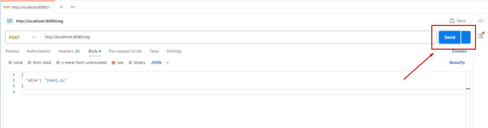

# <p style="text-align: center;">job4j_Url_Shortcut</p>

<a name="menu"></a>
<ul>
    <li>
        <a href="#about">About project</a>
        <ul>
            <li><a href="#description">Description</a></li>
            <li><a href="#technologies">Technologies</a></li>
        </ul>
    </li>
    <li>
        <a href="#build">Build</a>
    </li>
    <li>
        <a href="#usage">Usage</a>
        <ul>
            <li><a href="#postman">Download Postman</a></li>
            <li><a href="#registration">Site registration.</a></li>
            <li><a href="#authorization">Authorization</a></li>
            <li><a href="#urlRegistration.">URL registration.</a></li>
            <li><a href="#redirection">Redirection</a></li>
            <li><a href="#statistics">Statistics</a></li>
        </ul>
    </li>
</ul>

<h2><a name="about">About project</a>&nbsp;&nbsp;<a href="#menu">&#9650;</a></h2>
<h4><a name="description">Description</a>&nbsp;&nbsp;<a href="#menu">&#9650;</a></h4>
<p>
Url Shortcut - This project is a service for URL shortening and link management via a REST API.
Users can register their websites in the system and receive unique login credentials for further authorization.
After registration, they can submit long URLs, which the system will convert into short codes.
Later, when these codes are used, the system redirects users to the original URL using a 302 status code.
The service also tracks statistics for each URL, counting the number of calls, which is useful for traffic analysis and link performance monitoring.
</p>

<h4><a name="technologies">Technologies Used</a>&nbsp;&nbsp;<a href="#menu">&#9650;</a></h4>
<ul>

This project uses the following technologies and libraries:

1. **Spring Boot**:
    - Web development with REST API (`spring-boot-starter-web`).
    - Database interaction via JPA (`spring-boot-starter-data-jpa`).
    - Security and JWT-based authentication (`spring-boot-starter-security`).
    - Validation of incoming requests (`spring-boot-starter-validation`).
    - Testing with `spring-boot-starter-test`.

2. **JWT**:
    - JWT creation and verification using `jjwt-api`, `jjwt-impl`, and `jjwt-jackson`.

3. **Liquibase**:
    - Database version control and migrations with `liquibase-core`.

4. **PostgreSQL**:
    - PostgreSQL database driver for database connection.

5. **H2 Database**:
    - In-memory H2 database for runtime testing.

6. **Lombok**:
    - Code reduction for boilerplate code like getters, setters, and constructors.

7. **JUnit 5**:
    - Unit testing using `junit-jupiter-api`, `junit-jupiter-engine`, and `junit-platform-launcher`.

8. **Mockito**:
    - Mocking objects for testing with `mockito-core`.

9. **Plugins**:
    - Unit testing with `maven-surefire-plugin`.
    - Spring Boot application packaging and running with `spring-boot-maven-plugin`.
    - Test coverage reporting with `jacoco-maven-plugin`.

</ul>

</code></pre>

<h2><a name="build">Build</a>&nbsp;&nbsp;<a href="#menu">&#9650;</a></h2>
<ol>
    <li>
        To successfully build and run the project on your computer, you need to have the following installed:
        <ol>
            <li>JDK 17(+)</li>
            <li>Maven</li>
            <li>PostgreSQL</li>
        </ol>
    </li>
    <li>
        In PostgreSQL, create a database named "job4j_url_shortcut"..
    </li>
    <li>
        Download the project to your computer using the command<br>
        <code>git clone git@github.com:ValeraDanilov/job4j_url_shortcut.git</code><br>
        Navigate to the project root and configure database access..
    </li>
<li>
        Make the necessary changes to the file
        <code>src/main/resources/application.properties </code><br>

``` 
spring.datasource.username=your_username
spring.datasource.password=your_password
```

</li>
    <li>
        After configuring, run the command: <code>mvn install</code><br>
        This command will build the project and perform database migration using Liquibase.<br>
    </li>
</ol>

<h2><a name="usage">Usage</a>&nbsp;&nbsp;<a href="#menu">&#9650;</a></h2>

<h3><a name="postman">Download Postman</a>&nbsp;&nbsp;<a href="#menu">&#9650;</a></h3>
<p>
1. Downloading Postman
Visit the Postman Website:

Go to the <a href="#https://www.postman.com/downloads/">Postman Download Page.</a>

Select the Version:

Choose the version for your operating system (Windows, macOS, or Linux) and click the "Download" button.

Install Postman:

After installation, start the job4j_url_shortcut project using the Job4jUrlShortcutApplication class. Then, open Postman.
When you first launch the program, it will prompt you to sign in. You can skip this by clicking "Skip and go to the app."
</p>
<p style="text-align: center">
  
</p>
<h3><a name="registration">Site registration.</a>&nbsp;&nbsp;<a href="#menu">&#9650;</a></h3>
<p>
   1. Create a request. To do this, click on "+":
</p>
<p style="text-align: center">
  
</p>
<p>
   2. Select the POST request type:
</p>
<p style="text-align: center">
  
</p>
<p>
   3. Specify the URL: "http://localhost:8080/reg"
</p>
<p style="text-align: center">
  
</p>
<p>
   4. Go to the Body tab and click on "raw":
</p>
<p style="text-align: center">
  
</p>
<p>
   5. Select the data type JSON
</p>
<p style="text-align: center">
  
</p>
<p>
   6. Enter your side:
</p>
<p style="text-align: center">
  
</p>
<p>
   6. Click "Send"
</p>
<p style="text-align: center">
  
</p>
<p>
   7. As a result, you can observe the answer:
</p>
<p style="text-align: center">
  
</p>
<h3><a name="authorization">Authorization</a>&nbsp;&nbsp;<a href="#menu">&#9650;</a></h3>
<p>
  Authorization is done via JWT. The user sends a POST request with login and password and receives a key.
</p>
<p>
   1. Select the POST request type:
</p>
<p style="text-align: center">
  
</p>
<p>
   2. Specify the URL: "http://localhost:8080/auth"
</p>
<p style="text-align: center">
  
</p>
<p>
   3. Enter the login and password that you received earlier and click "Send.
</p>
<p style="text-align: center">
  
</p>
<p>
   4. As a result, you can observe the answer:
</p>
<p style="text-align: center">
  
</p>
<h3><a name="urlRegistration.">URL registration.</a>&nbsp;&nbsp;<a href="#menu">&#9650;</a></h3>
<p>
    After the user has registered his site, he can send links to the site and receive converted links.
</p>
<p>
   To convert links you need to authorization.
   Go to the Headers tab. In the first column (Key), enter Authorization. In the second column (Value), enter Bearer your_jwt_token, where your_jwt_token is the token you received during authorization.
</p>
<p style="text-align: center">
  
</p>
<p>
   1. Select the POST request type:
</p>
<p style="text-align: center">
  
</p>
<p>
   2. Specify the URL: "http://localhost:8080/url"
</p>
<p style="text-align: center">
  
</p>
<p>
   3. Enter your url and click "Send.
</p>
<p style="text-align: center">
  
</p>
<p>
   4. As a result, you can observe the answer:
</p>
<p style="text-align: center">
  
</p>
<h3><a name="redirection">Redirection</a>&nbsp;&nbsp;<a href="#menu">&#9650;</a></h3>
<p>
   When the site sends a link with a code, the response should return the associated URL and status 302.
</p>
<p>
   1. Select the GET request type, then specify the URL and code the side than you want redirect: "http://localhost:8080/url/redirect/side_code"
</p>
<p style="text-align: center">
  
</p>
<p>
   4. As a result, you can observe the answer:
</p>
<p style="text-align: center">
  
</p>
<h3><a name="statistics">Statistics</a>&nbsp;&nbsp;<a href="#menu">&#9650;</a></h3>
<p>
You can get statistics for all addresses on the site and the number of calls for each address.
</p>
<p>
   1. Select the GET request type, then specify the URL "http://localhost:8080/url/statistic"
</p>
<p style="text-align: center">
  
</p>
<p>
   4. As a result, you can observe the answer:
</p>
<p style="text-align: center">
  
</p>
